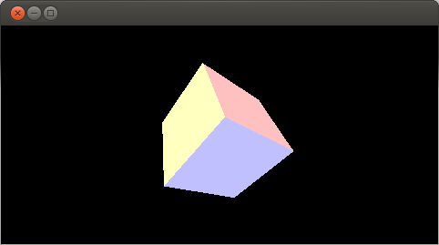

## OsecpuBasic version 0.0.10

OsecpuBasic は文法がC言語よりなBASIC言語のコンパイラーです。

osecpu-aska（マクロアセンブラー）によってコンパイルできるソースを出力します。

ライセンスは GPL2 です。

***

ビルド方法:

・ビルドには autoconf, automake, libtool が必要です。また、flex, bison も必要です。そして gcc, libc も当然必要です。

    ./autogen.sh --prefix=/usr
    make

これで src/ 以下に osecpubasic というバイナリができます。

***

使用方法:

・以下の方法で、BASICのソースファイルから、osecpu-aska のアセンブラコードへ変換できます。

    ./osecpubasic BASICのソースファイル.bas

これで、同名で拡張子が.askのファイルとして、カレントディレクトリ内に出力されます。
また、明示的に出力ファイル名を指定したい場合は

    ./osecpubasic BASICのソースファイル.bas 出力ファイル名.ask

とすることも可能です。
（ファイル名にパス名を含めても動作します）

***

現状できること:

***

スカラーおよび配列の宣言

・変数は宣言しないと使えません。

・配列は256次元配列まで使えます。

・添字でxを指定した場合は、確保される配列は 0 ～ x-1 までの x 個です。（c言語に近いです。一般的なBASICとは異なるかもしれません）

・dimを宣言の意味で使います。スカラー変数でも dim で宣言します。

・なお、配列宣言時に限り、配列の添字には数値リテラルしか指定できません（変数による添字範囲指定はできません）。また、長さが 0 の配列も未サポートです。

    dim a;
    dim b[10];
    dim c[1][2][3][4][5];

・宣言はカンマで区切って複数を連続させることも可能です

    dim a;
    dim b;
    dim c;
    
    dim a, b, c;

・スカラー変数に限っては、宣言時に同時に = で初期値を代入することも可能です。

    dim a = 1, b, c = 3;

***

変数への代入、および参照

・代入は = で行います。

・数は全て固定小数点型で扱われます。（符号1bit、整数15bit, 小数16bit）

    dim a;
    a = 10;

    dim b[100];
    b[a] = -3.14;

    dim c[100][100];
    c[a][a] = 123.456;
 

***

四則演算(+, -, *, /)、符号付き剰余算(%)、冪乗(pow)、論理演算(and, |, ^, ~)、三角関数(sin,cosのみ)、演算の括弧によるくくりを行えます。

・演算子の優先順位は * / %  の方が + - よりも優先されます。

（従って以下の例では 1 + 2 - (3 * 4 / 5 % 6)の順番で計算されます）

・また、論理演算は * / % よりも優先されますが、これについてはたまたまです。

（演算子の優先順位は、今後変更される可能性もあります）

    1 + 2 - 3 * 4 / 5 % 6
    ~ (1 and 2 | 3 ^ 4)

***

条件分岐

・ifによる条件分岐を行えます。これは条件式が真(非0)の場合に、以降のdeclarationを実行し、条件式が偽(0）の場合は（もしあれば）else 節以降のdeclarationを実行します。

・構文定義は以下となります:

    selection_if
        : if (expression) declaration
        | if (expression) declaration else declaration

・declaration の定義は以下となります:

    declaration
        : declaration_block
        | initializer ;
        | ope_matrix ;
        | expression ;
        | selection_if
        | iterator
        | jump ;
        | define_label ;
        | define_function
        | ;

すなわち、declaration には declaration_block が含まれるので、{ } で囲んで複数のステートメントを指定することもできます。

・具体的にはc言語のそれと同じ書式です:

    dim a = 0;
    
    if (a <= 10)
        a = a + 1;
    
    if (a == 0)
        a = 1;
    else
        a = 0;
    
    if (a == -1) {
        a = 1;
    } else {
        a = -1;
    }

***

繰り返しループ

・繰り返しループには、for と while があります。これらは条件式が真の間、以降の declaration を反復実行します。

・while の構文定義は以下となります:

    iterator
        : iterator_while
        | iterator_for
        ;
    
    iterator_while
        : while (expression) declaration
    
    iterator_for
        : for (expression; expression; expression) declaration

・具体的な例は以下のようになります。どちらもc言語と似た書式です:

    dim a;
    while (1)
        print a;
    
    while (a < 10) {
        print a;
        a = a + 1;
    }

    for (a = 0; a < 10; a = a + 1)
        print a;
    
    dim j;
    for (j = 0; j < 10; j = j + 1) {
        dim i;
        for (i = 0; i < 10; i = i + 1) {
            print (j * 10) + i;
        }
    }

***

ラベル

・ラベルは行の先頭でなければなりません。（インデントして書くことはできません）

・近々ラベルの書式は *LABEL_NAME ではなく、 LABEL_NAME: へと変える予定です。

    *L;
    *label;
    *end;

***

ラベルへの goto

    let a
    a = 0

    *L
    a = a + 1
    goto *L

***

ラベルへの gosub, return

・廃止しました。BASICなのに gosub, return がありません。

***

条件分岐 goto, gosub

・廃止しました。BASICなのに on goto, on gosub がありません。

***

ユーザー関数定義

・関数を定義できます。

・関数へ引数として渡した値は、ローカル変数となります。

・ローカル変数なので再帰的な呼び出しも可能です。

・関数に渡せる引数の数には制限はありません。

・配列を渡す場合は、アドレス渡しを用います。

・戻り値は、return 戻り値; によって戻します。

・構文定義は以下となります:

    define_function
        : function IDENTIFIER (identifier_list) { declaration_list }
    
    identifier_list
        : 
        | IDENTIFIER
        | IDENTIFIER , identifier_list
    
    declaration_list
        : declaration
        | declaration declaration_list

    jump
        : goto LABEL
        | return expression
        | return

・具体的な例は以下のようになります:

    function p(a)
    {
        print a;
    }

    function f(a, b, c)
    {
        return a + b + c;
    }

***

文字の扱いに関しては何も作ってません。

現状では文字は未サポートです。

***

ポインター

・変数のアドレスの取得と、アドレス先への読み書きを行えます。

・変数のアドレスを取得する場合は、演算子 & を用います:

    dim a;
    dim p = &a;

・アドレスは、数値リテラルを >> 16 した値なので、これを直接指定することもできます:

    /* アドレス 123 ワード を指定 */
    dim p = (123 >> 16)

・アドレスから値を読み出すには演算子 @ を用いて、既存の型をアタッチして行います:

    dim a[100];
    dim p = &a[50]; /* これで p には a[50] の位置を指すアドレスが入る */
    
    dim v[3]; /* アタッチする際に用いる型を、あらかじめ用意しておく */
    
    /* p へ v[3] をアタッチして、値を読み書きできる
     * この場合は a[50] ～ a[52] までを、v[0] ～ v[2] の3次ベクトルとみなして扱える
     */
    dim p@v[0] = 0;
    dim p@v[1] = 1;
    dim p@v[2] = 2;

***

行列演算

・廃止しました。

・代わりに申し訳程度に3x3行列用のライブラリー #include "matrix.bas" を追加してあります。

***

インラインアセンブラ

・現状では本当に素の、ただ文字列を .ask にそのまま出力するだけのインラインアセンブラです。
普通のインラインアセンブラのような、レジスターを自動的にスタックへ退避するようなサービスは無いです。
(必要ならば手動で行うことは可能です)

・構文定義は以下となります:

    const_strings
        : __CONST_STRING
        | const_strings __CONST_STRING
    
    inline_assembler
        : asm ( const_strings )
        | asm ( const_strings = expression )
        | asm ( expression = const_strings )

・使い方の具体的な例は以下のようになります:

    asm("junkApi_putConstString('hello\nworld\n');");
    
    asm(
        "junkApi_putConstString('hello ');"
        "junkApi_putConstString('world\n');"
    );
    
    dim x = 1;
    asm("fixL" = x);
    asm(x = "fixA");
    
    asm("R01" = x);
    asm(x = "R01");

***

別ファイルの入れ子

・#include "ファイル名" とすることで、そこの行へ、そのファイルの内容を埋め込むことができます。

・構文定義は以下となります:

    #include "ファイル名"

・入れ子したファイル内で、さらに #include することも可能です。この入れ子は 16 段までサポートしてます。
それ以上の入れ子の場合はエラーとなります。

・使い方の具体的な例は以下のようになります:

    #include "test.bas"

・お互いを入れ子にしてるような場合を、特に検出するようなコードはありませんが、実際は 16 段を越えてしまうのでエラーとなります:

    /* ファイル testA.bas */
    #include "testB.bas"

    /* ファイル testB.bas */
    #include "testA.bas"

    /* ファイル testC.bas */
    #include "testA.bas"

上記の例で testC.bas をコンパイルすると、入れ子制限の16段を越えた為のエラーとなります。
（循環参照を検出してのエラーとはなりません） 

***

マクロの定義

・マクロとして、任意の式へと置き換える識別子を定義できます。

・構文定義は以下となります:

    #define 識別子 式
    （改行が登場するまでを式とします）

・使い方の具体的な例は以下のようになります:

    #define A 123
    print A;

    #define iterator for (i = 0; i < e; i = i + 1)
    
    dim i;
    dim e = 10;
    iterator {
        print i;
    }

・プログラム中で、同名のマクロ定義が複数回登場した場合は、新しい定義によって上書きされます:

    #define A 123
    print A; /* 123 が印字されます */
    
    #define A 234
    print A; /* 234 が印字されます */

***

マクロの定義取り消し

・既に定義してあるマクロを、未定義状態にします。

・構文定義は以下となります:

    #undef 識別子

・使い方の具体的な例は以下のようになります:

    #define A 123
    print A; /* マクロ A は有効なので 123 が印字されます */
    
    #undef A
    print A; /* マクロ A は未定義状態なので、エラーとなります */

***

条件付きコンパイルマクロ

・ソースコードの任意範囲を、条件付きで部分的にコンパイル有効・無効を設定できます。

・構文定義は以下となります:

    #ifdef IDENTIFIER
    #ifndef IDENTIFIER
    #endif

・使い方の具体的な例は以下のようになります:

    #ifndef __STDIO_H__
    #define __STDIO_H__
    /* 何らかのソースコード */
    #endif

上記の例では、マクロ __STDIO_H__ が定義されていない場合に、#endif までの範囲が有効となります。
また逆に、任意の範囲を無効にしたい場合であれば以下のような方法も可能です:

    #ifdef ZERO
    /* 無効にしたいソースコード */
    #endif

複雑な条件式は未サポートです。

***

stdoscp.bas

・osecpubasic のプリセット関数を、外部ライブラリーとして置き換えたものです。
主に osecpu の junkApi_* をそのまま呼んでる類の関数をまとめてあります。

・使い方の具体的な例は以下のようになります:

    /* stdoscp.bas へのパスが通ってる状態で */
    #include "stdoscp.bas"
    __print(123);

・サポートする関数や、その使用方法に関しては stdoscp.bas のソースを直接読んでください。

***

math.bas

・osecpubasic のプリセット関数を、外部ライブラリーとして置き換えたものです。
主に数学ライブラリー関連の関数をまとめてあります。

・使い方の具体的な例は以下のようになります:

    /* math.bas へのパスが通ってる状態で */
    #include "math.bas"
    dim a = __sin(1.23);

・サポートする関数や、その使用方法に関しては math.bas のソースを直接読んでください。

***

matrix.bas

・主に行列演算関連のライブラリーです。（現状は3x3行列専用の素朴で単純な演算のみです）

・サポートする関数や、その使用方法に関しては matrix.bas のソースを直接読んでください。

***

stdgr.bas

・主にグラフィック描画関連のライブラリーです。

・使い方の具体的な例は以下のようになります:

    #include "math.bas"
    #include "stdgr.bas"
    __filltri(0, 10, 10, 20, 20, 10, 20, __torgb(255, 255, 255));

・サポートする関数や、その使用方法に関しては stdgr.bas のソースを直接読んでください。

